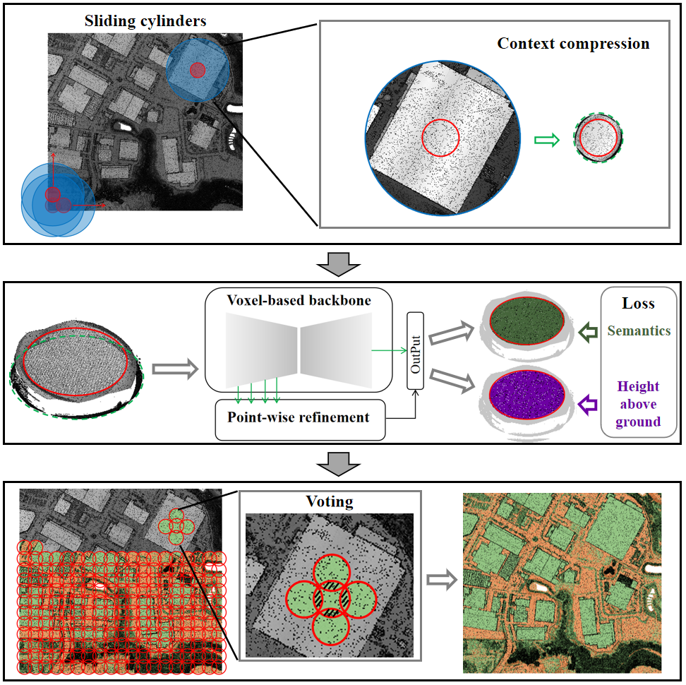
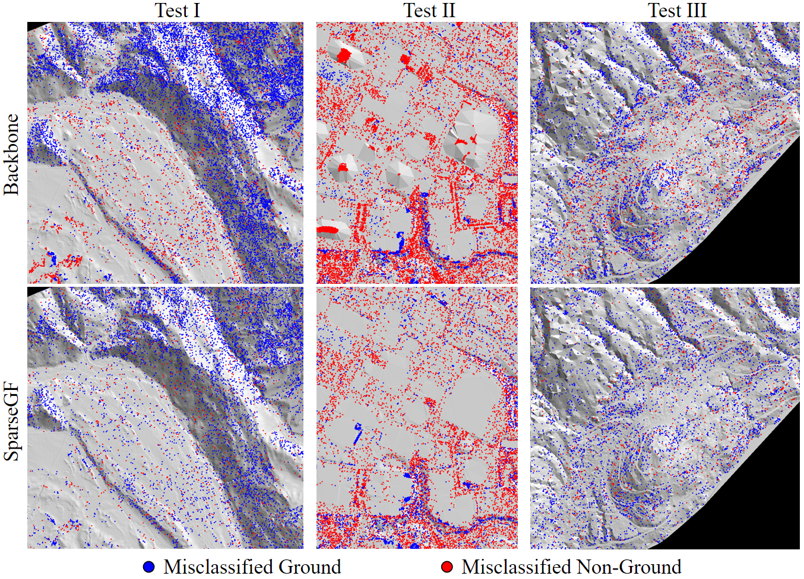
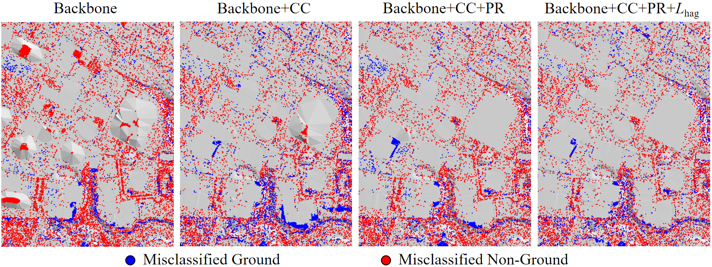

# SparseGF: A Height-Aware Sparse Segmentation Framework with Context Compression for Robust Ground Filtering of ALS Point Clouds

**SparseGF: A Height-Aware Sparse Segmentation Framework with Context Compression for Robust Ground Filtering of ALS Point Clouds** 

Nannan Qin, Pengjie Tao, Haiyan Guan, Zhizhong Kang, Lingfei Ma, Xiangyun Hu, Jonathan Li

**[[Paper](https://arxiv.org/pdf/2604.21356)]**

# Abstract
High‑quality digital terrain models derived from airborne laser scanning (ALS) data are essential for a wide range of geospatial analyses, and their generation typically relies on robust ground filtering (GF) to separate point clouds across diverse landscapes into ground and non‑ground parts. Although current deep‑learning‑based GF methods have demonstrated impressive performance, especially in specific challenging terrains, their cross‑scene generalization remains limited by two persistent issues: the context–detail dilemma in large‑scale processing due to limited computational resources, and the random misclassification of tall objects arising from classification‑only optimization. To overcome these limitations, we propose SparseGF, a height‑aware sparse segmentation framework enhanced with context compression. It is built upon three key innovations: (1) a convex-mirror-inspired context compression module that condenses expansive contexts into compact representations while preserving central details; (2) a hybrid sparse voxel-point network architecture that effectively interprets compressed representations while mitigating compression‑induced geometric distortion; and (3) a height‑aware loss function that explicitly enforces topographic elevation priors during training to suppress random misclassification of tall objects. Extensive evaluations on two large‑scale ALS benchmark datasets demonstrate that SparseGF delivers robust GF across urban to natural terrains, achieving leading performance in complex urban scenes, competitive results on mixed terrains, and moderate yet non‑catastrophic accuracy in densely forested steep areas. This work offers new insights into deep‑learning‑based GF research and encourages further exploration toward truly cross‑scene generalization for large‑scale environmental monitoring.

# Framework

# Experiment
(1) Results on OpenGF

(2) Progressive improvements on Test II

